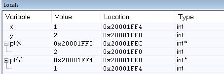

### Create a function in “C” that allows swapping of two pointers. 
    a. Explain what the “main” function does in order to setup the input arguments prior to calling the swap_pointer() function?
       Main pushes the values of x & y to stack, as well as the addresses for x & y. Then it loads the addresses for x & y into R0 & R1 respectfully, in order preparation for the ptrSwap function

    b. What are the values in R0 & R1 when swap_pointer() is called?
       R0 is 0x20001FEC (the location of parameter a) & R1 is 0x20001FE8 (the location of parameter b)

    c. Share a screen shot of the local variables inside of “main” after the function swap_pointer() returns showing the values of the pointers and what they are pointing to.
